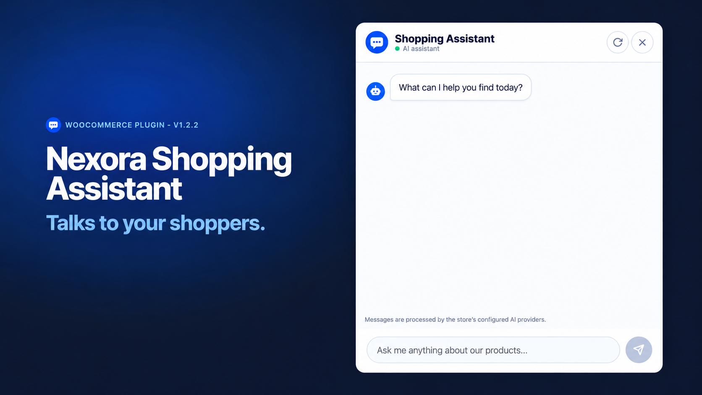

<div align="center">
  
  <h1>Nexora Shopping Assistant for WooCommerce</h1>
  <p><strong>Talk to your shoppers. Help them discover the right products.</strong></p>
  <p>
    <a href="https://nexoracreation.com/nexora-shopping-assistant-for-woocommerce-plugin/">Product page</a> ·
    <a href="https://github.com/nexoracteam/nexora-shopping-assistant/releases/download/v1.2.3/nexora-shopping-assistant-1.2.3.zip">Download plugin ZIP (v1.2.3)</a> ·
    <a href="readme.txt">WordPress readme & external services disclosure</a>
  </p>
  <p>
    <a href="branding/icon.png">Download icon (PNG)</a> ·
    <a href="branding/icon.svg">Download icon (SVG)</a>
  </p>
</div>

---

Nexora Shopping Assistant adds an AI-powered chat assistant to WooCommerce stores. Shoppers can describe what they need, explore relevant products, ask product questions, and add eligible simple products to their cart from the conversation.

> **Bring your own API key (BYOK).** Configure Groq, Google Gemini, or OpenAI. Provider usage is billed by the provider to the store owner; the plugin itself does not include AI credits.

## Features

- **Conversational product discovery** from your published WooCommerce catalogue.
- **Product cards and product questions** based on the product context made available to the assistant.
- **Cart actions for simple products**, with WooCommerce add-to-cart validation; other product types link to their product pages.
- **Provider choice and optional fallbacks** for Groq, Gemini, and OpenAI, with model discovery and connection testing.
- **Store-specific context** from a bounded snapshot of public product, category, policy-page, and menu content when configured.
- **Appearance settings** for assistant name, messages, colours, fonts, logo, and avatar.
- **Multiple launch options:** floating launcher, shortcode, hash link, and JavaScript API.
- **Privacy controls:** transcript storage is off by default, retention is configurable, and WordPress personal-data export/erasure hooks are provided for account-linked records.
- **Encrypted API keys** that are not exposed to the browser.

## Requirements

- WordPress 6.5 or later (readme metadata currently declares testing through WordPress 7.1).
- PHP 8.1 or later.
- WooCommerce installed and active.
- PHP `mbstring` plus Sodium or OpenSSL for credential encryption.

## Download and install

1. Download the [installable plugin ZIP for version 1.2.3](https://github.com/nexoracteam/nexora-shopping-assistant/releases/download/v1.2.3/nexora-shopping-assistant-1.2.3.zip).
2. In WordPress, open **Plugins → Add New Plugin → Upload Plugin**, select the ZIP, and activate it.
3. Open **Nexora Assistant → Providers**, add your own provider API key, choose a model, save, and use **Test connection**.
4. Check product synchronization under **Knowledge Base**. Optionally build store context with **Analyze**.
5. Review the assistant name, messages, appearance, privacy notice, and system prompt under **Settings & Styling**. Enable the assistant only after testing its responses.

For a unique encryption secret, add a random value of at least 32 characters to `wp-config.php` before storing API keys:

```php
define( 'CONVOCART_ENCRYPTION_KEY', 'replace-with-a-unique-random-secret' );
```

The constant name is retained for compatibility with earlier ConvoCart AI installations. Never commit real API keys, secrets, store data, or customer transcripts to this repository.

## Use the assistant

The shortcode below renders a button that opens the shared chat popup:

```text
[nexora_shopping_assistant]
```

Optional instance-labelled button:

```text
[nexora_shopping_assistant id="footer"]
```

The plugin also supports a `#nexora-shopping-assistant` hash link and the `window.NexoraShoppingAssistant` JavaScript API. Legacy ConvoCart AI identifiers—including `[convocart]`, `#convocart`, `window.ConvoCart`, the `CONVOCART_*` constants, and `/wp-json/convocart/v1/` routes—remain for compatibility.

## Privacy and external services

When the site administrator configures a provider, customer messages and limited context about candidate products and the conversation may be sent to that provider to generate a response. Shoppers can also type personal information into chat. Provider account terms and privacy policies apply. The plugin does not send data to Nexora Creation. Review the full [external services and privacy disclosure](readme.txt) before enabling the assistant publicly.

- Groq: <https://groq.com/privacy-policy>
- Google: <https://policies.google.com/privacy>
- OpenAI: <https://openai.com/policies/privacy-policy/>

## Compatibility notes

- Product cards are validated against candidate products provided to the model; prices and stock are re-read from WooCommerce before display.
- In-chat cart actions are limited to simple products.
- Network activation on multisite is not supported; activate the plugin separately on each site.
- The user interface is currently English-only.
- AI output may be inaccurate. Check answers, product availability, and store policies before enabling it for shoppers.

## Development and checks

The repository contains the plugin source and WordPress `readme.txt`. PHP syntax lint can be run with:

```bash
find . -name '*.php' -print0 | xargs -0 -n1 php -l
```

This repository does not claim that a full WordPress/WooCommerce integration suite, official Plugin Check, or WordPress.org review has passed. Run those checks on a staging installation before releasing changes.

## Security reports

Please report security issues privately through the [Nexora Creation contact page](https://nexoracreation.com/contact-us/). Do not post API keys, customer information, or exploitable details in public issues.

## Links

- Product information: <https://nexoracreation.com/nexora-shopping-assistant-for-woocommerce-plugin/>
- Nexora Creation: <https://nexoracreation.com/>
- License: GPL-2.0-or-later (see [`LICENSE`](LICENSE)).

---

<div align="center">
  <sub>Built by <a href="https://nexoracreation.com/">Nexora Creation</a> · Version 1.2.3</sub>
</div>
